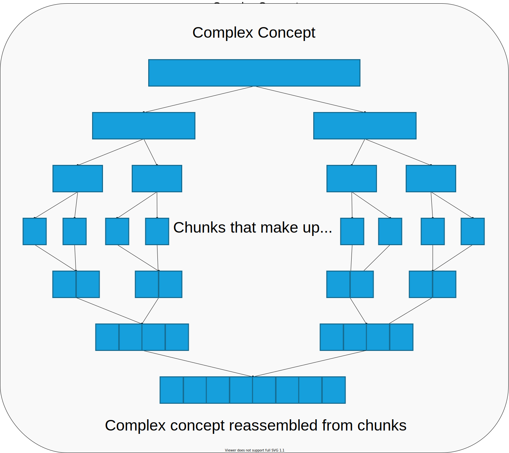

    Chunking & Spaced Review 
    <a href="#tldr">TL;DR</a>

---

    <h2>Chunking</h2>

 

When we’re trying to learn complex information, it helps to separate related data into smaller groups to make it easier to process.

We can break up the concepts using a technique called chunking.

Meaningful bits of information, or **chunks**, are grouped together so that the brain can more easily encode and relate that information to previous knowledge, which makes it easier to recall later.

 

## The process of chunking can be broken down into the following steps:

1. Look at the big picture

Take an overview of the subject as a whole to see where the information might lead. Don’t pay particular attention to any details.

2. Break big ideas up into smaller ideas

Take a look at the core topics and try to anticipate what type of information might be covered in each one.

3. Focus on one small concept at a time

Study and practice recalling the particular ideas within the smaller concept, perhaps even forgetting about the big picture for a moment to really pay attention to the details.

4. Apply smaller ideas in a variety of contexts

This will solidify understanding of the smaller ideas and start to open up the avenues for forming connections between smaller parts of the overall topic.

5. Organize the smaller ideas into larger ideas

Once we start to recognize patterns in the information, we can group smaller ideas together to attempt to recreate the complexity of the original subject.

6. Relate each larger idea back to the original concept and to other smaller concepts

Consider each chunk’s place in the overall subject and how it ties into the previously studied chunks

7. Repeat as many times as necessary

Regular review of the information will ensure quick and accurate recall of the information when needed.

 

---

    <h2>Chunking Example</h2>

Imagine that we're given a string of characters and told to count how many dollar signs $ appear in the string.

 

    ?$*@?$#*??$#**@$@#?*@#$#@

 

The way the string is organized, it might take a few seconds to scan the string to count the dollar signs.

However, if we take a moment to sort the string by character:

 

    ##### ????? ***** $$$$$ @@@@@

 

We can see, at a glance that there are **five** dollar signs and it would make counting the other characters much simpler as well.

    What a big difference a little organization makes!

 

    <a href="#top">Back to top &mapstoup;</a>

---

    <h2>Spaced Review</h2>

 

 

New information fades quickly as soon as we learn it, represented here by red line on the chart.

We can see that retention of the information is almost 100% as soon as it’s processed, but drops dramatically shortly thereafter until we review it.

With each review, our understanding increases, as represented by the green line on the chart.

Reviewing also slows the forgetting curve, helping us retain more information for longer periods of time until eventually we’ve remembered more than we’ve forgotten.

 

---

    <h2 id="tldr">TL;DR</h2>

 

Chunking is an excellent technique for efficiently dividing a complex subject into more digestible sections.

Once the larger subject is divided, we can focus on the smaller concepts in more detail, eventually connecting them back to the complex subject as a whole.

Even after breaking information up, if we want the information to become second nature, we still need to revisit it regularly.

 

---

<table style="width:100%">
    <tr>
        <td align="left">
            <a href="./short_term_memory.md"> < 4. Short-Term Memory </a>
        </td>
        <td align="center">
            <a href="#top">Back to top &mapstoup;</a>
        </td>
        <td align="right">
            <a href="./cognitive_biases.md"> 6. Cognitive Biases > </a>
        </td>
    </tr>
</table>
