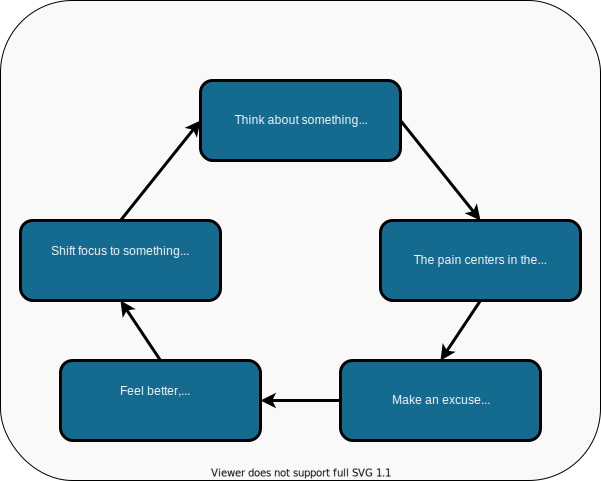
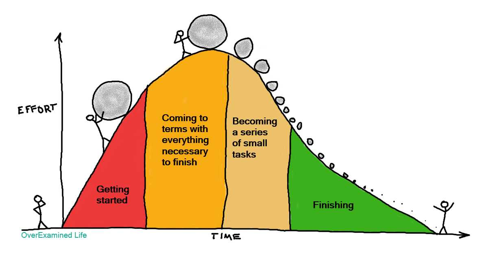

    Procrastination 
    <a href="#tldr">TL;DR</a>

---

 

It’s easy for us to find distaste in something we’re not good at yet. 

We’ve all been there - sitting, putting off a task we know we should do. We find all sorts of excuses and time-fillers to distract us and while this may make us feel better in the moment, we suffer in the end. 

Don’t worry though, no one is alone in this. Studies show that up to 88% of people procrastinate while working, and that’s just those who are brave enough to admit it. 

 
 

 
 

The result of this cycle is that the dread of doing a task uses up more time and energy than doing the task itself. 

 

 

The most difficult part of any task is getting started. Once we begin, we gain momentum and before we know it, we’re cruising right along, making great progress on what we need to do. 

Once we cross the threshold of action, the pain begins to subside. The guilt, shame, and anxiety that we feel while procrastinating are usually far worse than the effort we have to put in while we’re working. 

The problem is not doing the work, it’s <i>starting</i> the work. 

 
 

--- 

    <h2>Types of Procrastination</h2>

There are four main architypes for procrastination.

1. The Performer

This procrastinator forces themselves to focus by shrinking the time they have to tackle a task. They wait until the last second to begin and frantically rush to meet the deadline.

Biggest challenge: Getting started.

Your solution: Focus on a time to begin a task, not when it needs to be done  This will take a tremendous amount of pressure off of the situation.

 
 

2. The Self-Deprecator 

This procrastinator tends to blame inaction on laziness or stubbornness rather than admit they are tired. When they don't do something they are extra hard on themselves.

Biggest challenge:  Taking a break.

Your solution: Recharge.  Try taking a walk to give yourself space and to begin to rebuild your energy. 

 
 

3. The Overbooker

This procrastinator is a pro at filling up their calendar and is often overwhelmed. When busy-ness comes up as an excuse for not doing something, it's usually an indication of avoidance. 

Rather than facing a challenge head on or admitting they don't want to do something, it's easier to place the blame on having other important things to do. 

Your biggest challenge:  Creating chaos to avoid facing what we know we need to face right now.

Your solution: Take a moment of introspection. Ask: What am I really avoiding?

 
 

3. The Novelty Seeker

This procrastinator is constantly coming up with new projects to take on — and then getting bored with them a week later. They're intrigued by the latest trend and will be quick to implement but not follow through. 

They are great at making decisions and taking action. However, they end up inadvertently losing a lot of time and burning out because they don't take consistent action in one direction long enough to see results.

Your biggest challenge: Completion.

Your solution: Write down new ideas or projects, but don't pursue them until you finish what you are currently working on. 

 
 

---

    <h2>Overcoming Procrastination</h2>

 

Be Kind to Yourself 

**We can’t beat ourselves up about procrastinating.** We must acknowledge the desire to procrastinate, sit with it for a moment, take a deep breath and make the conscious decision not to follow that desire.

**Changing habits takes lots of patience** and compassion towards oneself, but the outcome is worth the effort. 

 
 

Figure Out Why 

We need to identify the reasons why we’re procrastinating before we can begin to tackle them.
 

Are we avoiding a task because we find it boring or unpleasant? 

Are we overwhelmed by the breadth of the task and hand and need to do a little organizing before we can begin? 

Perhaps we’re feeling afraid of failure, or even *success*?

 
 

Adjust Inner Dialogue 

The way we word the excuses we make to ourselves can have a big impact on productivity. 
 

For instance, instead of saying, 

 

<b>“I have plenty of time, why start now?”</b>
 

 

we could say, 

 

<b>“I have plenty of time, but I’ll feel better if I don’t wait until the last minute.”</b>
 

 

Adjusting our inner dialogue can make all the difference. 

Instead of using words like “have to” or “should”, which make our tasks feel like chores, we can say “I choose to ...” which implies that we own our project and can make us feel more in control of our workload.

 
 

Adopt Practical Strategies 

At its core, procrastination is a habit, but all habits can be undone.
 

Here are some ideas for confronting procrastination:

1. Commit to the task - Break the task up into smaller pieces, write all the smaller tasks down and specify times for doing them

2. Promise yourself a reward - When you complete a task, be sure to reward yourself for your efforts. It doesn’t have to be much, just enough to enjoy the satisfaction of completing a task.

3. Minimize distractions - Silence your phone and all other devices while working. Avoid multitasking and listen to unobtrusive music.

4.  “Eat an Elephant Beetle” First Thing  - No, this doesn’t require the consumption of any insects. 

This means conquering the hardest, least desirable task first thing in the morning so you don’t waste energy dreading it all day.

5. Keep a regular schedule - Start studying at a particular time each day to begin to develop positive study habits.

 

---

 

The trick to overwriting a habit is to look for the pressure point – our reaction to a cue. 

The only place we need to apply willpower is to change our reaction to the cue. It takes a little practice before one starts to enjoy the work...

The better we get at something, the more enjoyable it can become. We need to believe the system can work. 

 

If we can undo our procrastination habit, a myriad of positive changes will begin to unfold.

 

---

    <h2 id="tldr">TL;DR</h2>

 

Procrastionation the habitual action of delaying or postponing something and can present itself in many forms. 

The irony of procrastination is that the dread of doing a task uses up more time and energy than doing the task itself. 

As with all habits, procrastination takes effort to undo. Through strategies like keeping a regular schedule, rewarding ourselves when we complete something, or dividing goals into smaller tasks, we can overcome the negative patterns of procrastination and conjur success! 

 

---

<table style="width:100%">
    <tr>
        <td align="left">
            <a href="./cognitive_biases.md"> < 6. Cognitive Biases </a>
        </td>
        <td align="center">
            <a href="#top">Back to top &mapstoup;</a>
        </td>
        <td align="right">
            <a href="./practical_study_techniques.md"> 8. Practical Study Techniques > </a>
        </td>
    </tr>
</table>
