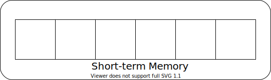
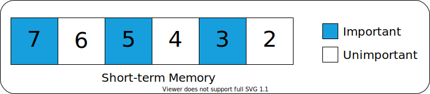
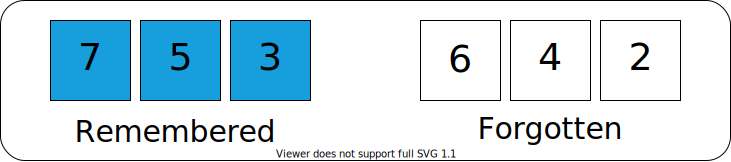

    Short-Term Memory 
    <a href="#tldr">TL;DR</a>

---

 

The amount of information that can be stored in short-term memory can vary.

Modern research suggests that we can store between four and six pieces of information in short-term memory, depending on the complexity of each piece.

 

    

 

As we focus on a subject, we fill up our short-term memory.

 

Eventually, our short-term memory reaches capacity.

 

If we force ourselves to continue focusing, 
old information is pushed out to make room for new information.

 

Taking a break instead will allow our brain to determine which pieces of information important and which are not.

 

The important information is encoded in long-term memory and the rest is forgotten.

 

 

---

    <h2 id="tldr">TL;DR</h2>

 

Our short-term memory can only hold a few pieces of information at a time. To avoid frustration and increase recall, it's important to take frequent breaks while learning to allow information to be assimilated in to long-term memory.

 

---
 
<table style="width:100%">
    <tr>
        <td align="left">
            <a href="./the_brain_and_memory.md"> < 3. The Brain & Memory </a>
        </td>
        <td align="center">
            <a href="#top">Back to top &mapstoup;</a>
        </td>
        <td align="right">
            <a href="./chunking_and_spaced_review.md"> 5. Chunking and Spaced Review > </a>
        </td>
    </tr>
</table>

